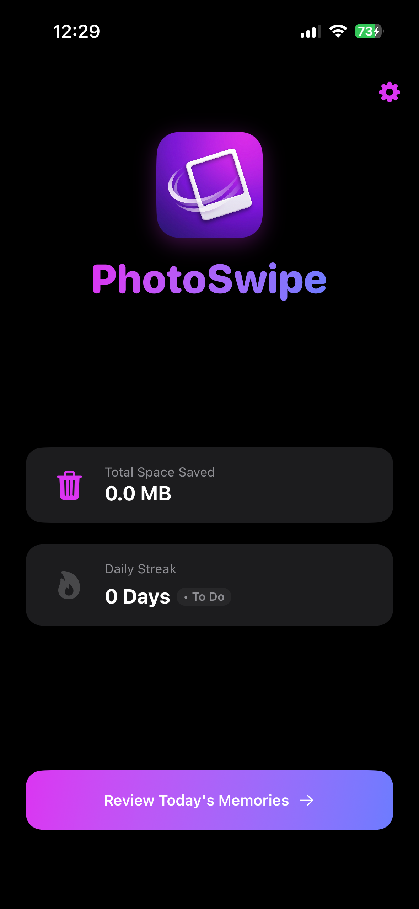
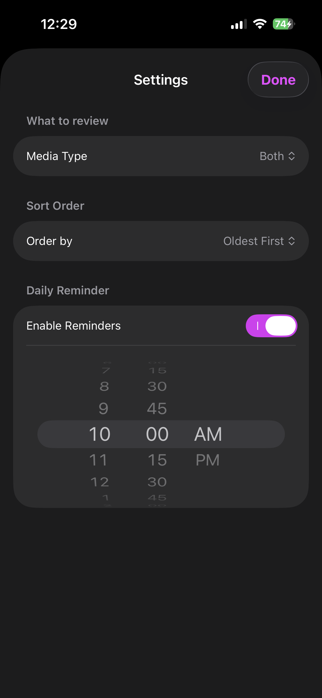
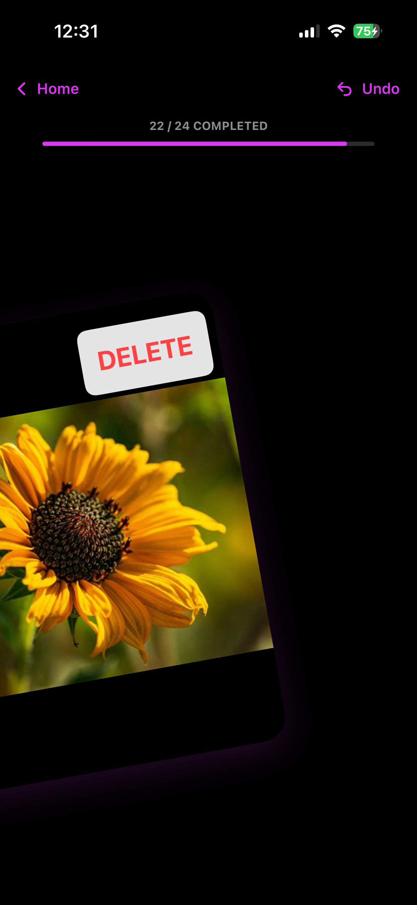
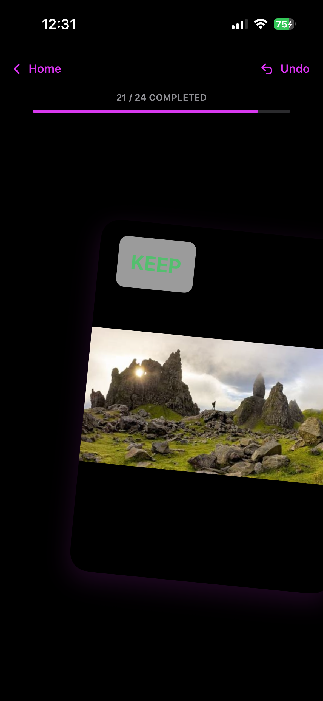
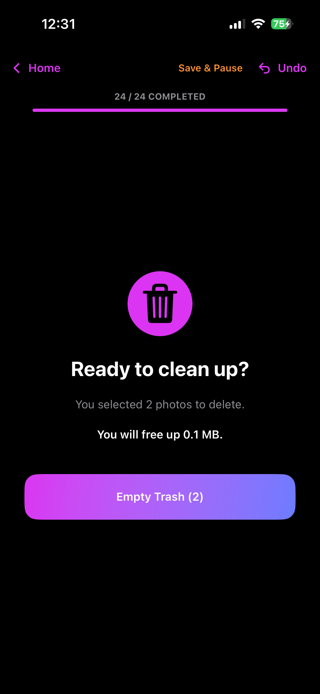
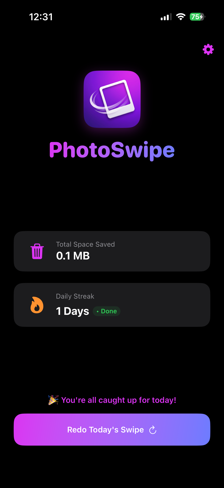

## What This App Is and Why

I noticed that my iPhone photo library was growing too quickly, so I made it a habit to spend a little time every day reviewing photos and videos to delete what I do not need and free up storage.

Reviewing the entire library at once would be overwhelming, so I usually check the photos taken on the same day in previous years. That lets me handle the library day by day while also revisiting memories from that date.

Then I thought: "Why not build an app that helps me do this with a good interface, some statistics, and a bit of gamification?"

There are already plenty of apps in the iOS App Store that do similar things, but I wanted something very simple with only the features I care about. So I built my own. This is the result.

Publishing it on the App Store would probably be too difficult, so I expect to be the only user. Still, if someone wants to try it or improve it, I would be very happy.

## What the App Does

The app keeps things intentionally basic:

### Settings

- Choose whether to review photos, videos, or both.
- Choose the order: oldest to newest, newest to oldest, or random.
- Enable a notification to remind you to review that day.

### Statistics

- Space freed: I wanted to know how much storage I recovered by using the app.
- Streak: a little gamification to encourage consistency.

### Swiping

- Swipe right to keep a photo.
- Swipe left to delete it.
- When you swipe left, the photo is not deleted immediately, and you can undo the swipe.
- At the end, a popup asks whether you want to delete the selected items.

That is it. Nothing more. I needed this app, so I built it.

## Screenshots

  
   
  

  
   
  

